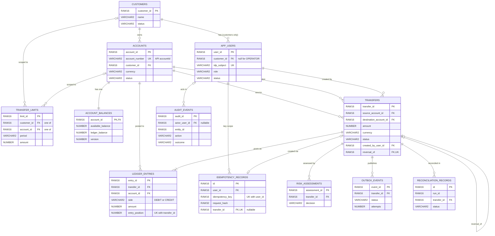

# Milestone 2 - Oracle ERD & Physical Design

Status: **Design decisions P1-P9 APPROVED (2026-09-18).** Migrations V1-V6 written; see section 9 for test status.
Builds on the approved contract in `docs/milestone-1-contract.md`.

Already decided: UUID storage is `RAW(16)` everywhere (approved 2026-09-18).

## 1. Design decisions (P1-P9 approved as proposed, 2026-09-18)

| # | Decision | Approved position | Reason |
|---|----------|----------|--------|
| P1 | Public account ID vs internal key | `ACCOUNTS.ACCOUNT_ID RAW(16)` is the internal PK. `ACCOUNTS.ACCOUNT_NUMBER VARCHAR2(32)` (unique) is what the API calls `accountId` (e.g. `ACC001`). | The API contract uses readable IDs like `ACC001`, which are not UUIDs. All FKs use the RAW(16) key. Lock ordering (contract: "stable account-ID order") uses `ACCOUNT_ID`. |
| P2 | ID generation | Application generates time-ordered UUIDs (UUIDv7) and binds them as RAW(16). No sequences. `SYS_GUID()` is not used as a default. | Time-ordered keys keep index inserts near the right edge of the B-tree. Random keys scatter writes. |
| P3 | Operators have no customer | `APP_USERS.CUSTOMER_ID` is NULL for `OPERATOR`, required for `CUSTOMER` (CHECK). | Operators are support staff, not customer users (D2). |
| P4 | Idempotency record can exist without a transfer | `IDEMPOTENCY_RECORDS.TRANSFER_ID` is nullable but UNIQUE. | Contract: every 422 outcome is stored and replayed, and most 422s never create a transfer. UNIQUE still enforces 1:1 where a transfer exists (Oracle allows many NULLs in a unique index on one column). |
| P5 | Extra columns beyond the briefing | `TRANSFERS.CREATED_BY_USER_ID`, `TRANSFERS.REFERENCE`, `LEDGER_ENTRIES.BALANCE_AFTER`, idempotency `STATUS`/`RESPONSE_STATUS`/`RESPONSE_BODY`, `AUDIT_EVENTS.ACTOR_ROLE`/`CORRELATION_ID`, `RECONCILIATION_RECORDS.RUN_ID`. | Each is required by the approved contract (identity, `reference`, replay of the original outcome, operator auditing, grouping reconciliation runs) or by reconciliation. |
| P6 | Reversal uniqueness | `TRANSFERS.REVERSAL_OF` has a UNIQUE constraint. | A transfer is reversed at most once (contract cardinality 0:1). Also serves as the FK index. Loosen if partial reversals are wanted. |
| P7 | Currency check | `CHECK (currency IN ('USD'))` on every currency column (D4). | Adding a currency later needs an additive migration that replaces the CHECK. |
| P8 | Runtime cannot DELETE anywhere | No DELETE privilege on any table for the runtime user. Purging is a separate, deliberate job (section 7). | Ledger, audit and idempotency data must not be removable by a compromised app. |
| P9 | Third database identity | Optional `FUNDS_RECON` (read-only) for the reconciliation job. Deferred by default. | The briefing wants the ledger invariant independently reconciled. A separate read-only principal makes that independence real. |

## 2. ERD

Renders in GitHub and in the VS Code Markdown preview with a Mermaid extension. Only keys and the columns that define relationships are shown; the full column list is in section 3.



Cardinality check against the approved contract:

| Contract rule | Enforced by |
|---------------|-------------|
| Customer -> Account 1:N | `ACCOUNTS.CUSTOMER_ID` NOT NULL FK |
| Customer -> User 1:N | `APP_USERS.CUSTOMER_ID` FK (NULL only for operators) |
| Account -> Transfer 1:N in both roles | Two FKs on `TRANSFERS`; CHECK source <> destination |
| Transfer -> LedgerEntry 1:N, two balanced entries | FK + `UNIQUE(TRANSFER_ID, ENTRY_POSITION)`. Balancing is checked in the posting service and by reconciliation, not by a DB constraint |
| Transfer -> IdempotencyRecord 1:1 | `UNIQUE(TRANSFER_ID)` on the idempotency record |
| Transfer -> Risk / Audit / Outbox 1:N | FKs (audit references the entity by ID, see section 3) |
| Transfer -> Reconciliation 0:N | FK + `UNIQUE(RUN_ID, TRANSFER_ID)` |
| Reversal is a new linked transfer | `TRANSFERS.REVERSAL_OF` self-FK, UNIQUE |

## 3. Data dictionary

Conventions: `NN` = NOT NULL. All timestamps are `TIMESTAMP WITH TIME ZONE`, written in UTC. All money is `NUMBER(19,4)`. Status columns are `VARCHAR2` with a named CHECK, not lookup tables. Constraint names: `PK_`, `FK_`, `UK_`, `CK_`, `IX_` + table/column.

### CUSTOMERS
| Column | Type | Null | Notes |
|--------|------|------|-------|
| CUSTOMER_ID | RAW(16) | NN | PK |
| NAME | VARCHAR2(200) | NN | |
| STATUS | VARCHAR2(20) | NN | CHECK IN (`ACTIVE`,`SUSPENDED`,`CLOSED`) |
| CREATED_AT / UPDATED_AT | TIMESTAMP WITH TIME ZONE | NN | |

### APP_USERS
| Column | Type | Null | Notes |
|--------|------|------|-------|
| USER_ID | RAW(16) | NN | PK |
| CUSTOMER_ID | RAW(16) | | FK -> CUSTOMERS |
| IDP_SUBJECT | VARCHAR2(255) | NN | UNIQUE. Token subject |
| ROLE | VARCHAR2(20) | NN | CHECK IN (`CUSTOMER`,`OPERATOR`) |
| STATUS | VARCHAR2(20) | NN | CHECK IN (`ACTIVE`,`DISABLED`) |
| CREATED_AT / UPDATED_AT | TIMESTAMP WITH TIME ZONE | NN | |

Table CHECK: `(ROLE='CUSTOMER' AND CUSTOMER_ID IS NOT NULL) OR (ROLE='OPERATOR' AND CUSTOMER_ID IS NULL)`.

### ACCOUNTS
| Column | Type | Null | Notes |
|--------|------|------|-------|
| ACCOUNT_ID | RAW(16) | NN | PK. Lock-order key |
| ACCOUNT_NUMBER | VARCHAR2(32) | NN | UNIQUE. API `accountId`. CHECK `REGEXP_LIKE(ACCOUNT_NUMBER,'^[A-Za-z0-9_-]{1,32}$')` matches the OpenAPI pattern |
| CUSTOMER_ID | RAW(16) | NN | FK -> CUSTOMERS |
| CURRENCY | VARCHAR2(3) | NN | CHECK IN (`USD`) |
| STATUS | VARCHAR2(20) | NN | CHECK IN (`ACTIVE`,`FROZEN`,`CLOSED`). Only `ACTIVE` may transfer |
| CREATED_AT / UPDATED_AT | TIMESTAMP WITH TIME ZONE | NN | |

### ACCOUNT_BALANCES
| Column | Type | Null | Notes |
|--------|------|------|-------|
| ACCOUNT_ID | RAW(16) | NN | PK and FK -> ACCOUNTS |
| AVAILABLE_BALANCE | NUMBER(19,4) | NN | CHECK >= 0 (no overdraft in V1) |
| LEDGER_BALANCE | NUMBER(19,4) | NN | CHECK >= 0 |
| VERSION | NUMBER(19) | NN | Default 0. Incremented on every update |
| UPDATED_AT | TIMESTAMP WITH TIME ZONE | NN | |

Table CHECK `CK_ACCT_BAL_EQUAL`: `AVAILABLE_BALANCE = LEDGER_BALANCE`. **Holds are out of V1** (posting is synchronous; a `PENDING_REVIEW` transfer reserves no funds and re-checks funds when it posts), so the database enforces equality and the posting service updates both columns in one statement. Both columns exist so the API's `Balance` shape does not change later.

If holds are ever wanted, that is a new design, not a loosened constraint: an explicit hold table (hold ID, account, transfer, amount, status, created/released times), the rule `AVAILABLE = LEDGER - SUM(active holds)`, and state rules for placing, releasing and capturing a hold, delivered as an additive migration that replaces `CK_ACCT_BAL_EQUAL`. The row is the `SELECT ... FOR UPDATE` lock target.

### TRANSFERS
| Column | Type | Null | Notes |
|--------|------|------|-------|
| TRANSFER_ID | RAW(16) | NN | PK |
| SOURCE_ACCOUNT_ID | RAW(16) | NN | FK -> ACCOUNTS |
| DESTINATION_ACCOUNT_ID | RAW(16) | NN | FK -> ACCOUNTS |
| AMOUNT | NUMBER(19,4) | NN | CHECK > 0 |
| CURRENCY | VARCHAR2(3) | NN | CHECK IN (`USD`) |
| STATUS | VARCHAR2(20) | NN | CHECK IN the 8 approved states |
| REFERENCE | VARCHAR2(140) | | Untrusted free text |
| CREATED_BY_USER_ID | RAW(16) | NN | FK -> APP_USERS. From the token, never the request |
| REVERSAL_OF | RAW(16) | | FK -> TRANSFERS (self). UNIQUE (P6) |
| CREATED_AT / UPDATED_AT | TIMESTAMP WITH TIME ZONE | NN | |

Table CHECKs: `SOURCE_ACCOUNT_ID <> DESTINATION_ACCOUNT_ID`; `REVERSAL_OF IS NULL OR REVERSAL_OF <> TRANSFER_ID`. The legal state transitions are enforced in code and tests, not in the database.

### LEDGER_ENTRIES (append-only)
| Column | Type | Null | Notes |
|--------|------|------|-------|
| ENTRY_ID | RAW(16) | NN | PK |
| TRANSFER_ID | RAW(16) | NN | FK -> TRANSFERS |
| ACCOUNT_ID | RAW(16) | NN | FK -> ACCOUNTS |
| SIDE | VARCHAR2(6) | NN | CHECK IN (`DEBIT`,`CREDIT`) |
| AMOUNT | NUMBER(19,4) | NN | CHECK > 0 |
| ENTRY_POSITION | NUMBER(3) | NN | CHECK >= 1. `UNIQUE(TRANSFER_ID, ENTRY_POSITION)` |
| BALANCE_AFTER | NUMBER(19,4) | NN | Ledger balance of `ACCOUNT_ID` after this entry. Lets reconciliation replay balances |
| POSTED_AT | TIMESTAMP WITH TIME ZONE | NN | |

### IDEMPOTENCY_RECORDS
| Column | Type | Null | Notes |
|--------|------|------|-------|
| ID | RAW(16) | NN | PK |
| USER_ID | RAW(16) | NN | FK -> APP_USERS |
| IDEMPOTENCY_KEY | RAW(16) | NN | The client UUID. `UNIQUE(USER_ID, IDEMPOTENCY_KEY)` |
| REQUEST_HASH | RAW(32) | NN | SHA-256 of the canonical body |
| STATUS | VARCHAR2(12) | NN | CHECK IN (`IN_PROGRESS`,`COMPLETED`,`ABORTED`) |
| ATTEMPT | NUMBER(5) | NN | Default 1, CHECK >= 1. Fencing token, +1 on each takeover |
| LEASE_EXPIRES_AT | TIMESTAMP WITH TIME ZONE | | Set only while `IN_PROGRESS` |
| TRANSFER_ID | RAW(16) | | FK -> TRANSFERS. UNIQUE (P4) |
| RESPONSE_STATUS | NUMBER(3) | | HTTP code of the original outcome. Set when `COMPLETED` |
| RESPONSE_BODY | CLOB | | Original JSON body. CHECK `IS JSON`. NULL after purge |
| CREATED_AT | TIMESTAMP WITH TIME ZONE | NN | |
| COMPLETED_AT | TIMESTAMP WITH TIME ZONE | | Set when `COMPLETED` |
| REPLAY_EXPIRES_AT | TIMESTAMP WITH TIME ZONE | | Completion time + configured retention. NULL once purged |
| RESPONSE_PURGED_AT | TIMESTAMP WITH TIME ZONE | | Set when the body is purged; the record itself stays |

Table CHECKs: `CK_IDEMP_LEASE` (lease present exactly while `IN_PROGRESS`); `CK_IDEMP_COMPLETED` (completed needs status code, completion time, and a body or a purge stamp); `CK_IDEMP_NO_OUTCOME` (a non-completed record carries no transfer, response or expiry); `CK_IDEMP_REPLAY` and `CK_IDEMP_PURGED` (a purged body is gone and no longer replayable).

Trigger `TRG_IDEMP_COMPLETED_IMMUTABLE`: once `COMPLETED`, an `UPDATE` may change only `RESPONSE_BODY`, `RESPONSE_PURGED_AT` and `REPLAY_EXPIRES_AT`; anything else raises `ORA-20002`.

### TRANSFER_LIMITS
| Column | Type | Null | Notes |
|--------|------|------|-------|
| LIMIT_ID | RAW(16) | NN | PK |
| CUSTOMER_ID | RAW(16) | | FK -> CUSTOMERS |
| ACCOUNT_ID | RAW(16) | | FK -> ACCOUNTS |
| PERIOD | VARCHAR2(12) | NN | CHECK IN (`PER_TRANSFER`,`DAILY`,`MONTHLY`) |
| AMOUNT | NUMBER(19,4) | NN | CHECK > 0 |
| CURRENCY | VARCHAR2(3) | NN | CHECK IN (`USD`) |
| EFFECTIVE_FROM | TIMESTAMP WITH TIME ZONE | NN | |
| EFFECTIVE_TO | TIMESTAMP WITH TIME ZONE | | NULL = open-ended |

Table CHECKs: exactly one of `CUSTOMER_ID` / `ACCOUNT_ID` is set; `EFFECTIVE_TO IS NULL OR EFFECTIVE_TO > EFFECTIVE_FROM`. Limits are changed by adding a new row, never by editing an old one.

### RISK_ASSESSMENTS (never exposed through the API)
| Column | Type | Null | Notes |
|--------|------|------|-------|
| ASSESSMENT_ID | RAW(16) | NN | PK |
| TRANSFER_ID | RAW(16) | NN | FK -> TRANSFERS |
| DECISION | VARCHAR2(10) | NN | CHECK IN (`APPROVE`,`REVIEW`,`REJECT`) |
| REASON | VARCHAR2(500) | | Internal only |
| RISK_SCORE | NUMBER(5,2) | | |
| ASSESSED_AT | TIMESTAMP WITH TIME ZONE | NN | |

### OUTBOX_EVENTS
| Column | Type | Null | Notes |
|--------|------|------|-------|
| EVENT_ID | RAW(16) | NN | PK. Also the consumers' dedup key (at-least-once delivery) |
| TRANSFER_ID | RAW(16) | NN | FK -> TRANSFERS |
| EVENT_TYPE | VARCHAR2(50) | NN | |
| PAYLOAD | CLOB | NN | CHECK `IS JSON` |
| STATUS | VARCHAR2(12) | NN | CHECK IN (`PENDING`,`PUBLISHED`,`FAILED`) |
| ATTEMPTS | NUMBER(5) | NN | Default 0, CHECK >= 0 |
| CREATED_AT | TIMESTAMP WITH TIME ZONE | NN | |
| LAST_ATTEMPT_AT / PUBLISHED_AT | TIMESTAMP WITH TIME ZONE | | |

### AUDIT_EVENTS (immutable)
| Column | Type | Null | Notes |
|--------|------|------|-------|
| AUDIT_ID | RAW(16) | NN | PK |
| ACTOR_USER_ID | RAW(16) | | FK -> APP_USERS. NULL for `SYSTEM` |
| ACTOR_ROLE | VARCHAR2(10) | NN | CHECK IN (`CUSTOMER`,`OPERATOR`,`SYSTEM`) |
| ACTION | VARCHAR2(50) | NN | e.g. `TRANSFER_CREATE`, `TRANSFER_CANCEL`, `OPERATOR_READ` |
| ENTITY_TYPE | VARCHAR2(30) | NN | |
| ENTITY_ID | RAW(16) | NN | No FK: one column points at several tables, and audit rows must outlive their subject |
| OUTCOME | VARCHAR2(10) | NN | CHECK IN (`SUCCESS`,`DENIED`,`FAILURE`) |
| CORRELATION_ID | VARCHAR2(64) | | Ties the row to the API call |
| DETAIL | VARCHAR2(2000) | | Never secrets or payloads |
| CREATED_AT | TIMESTAMP WITH TIME ZONE | NN | |

Immutability, defence in depth: (1) runtime user has only `INSERT` and `SELECT`; (2) a `BEFORE UPDATE OR DELETE` trigger raises an error for everyone, including the owner. Every operator read and cancel writes a row here (follow-up from D2).

### RECONCILIATION_RECORDS
| Column | Type | Null | Notes |
|--------|------|------|-------|
| ID | RAW(16) | NN | PK |
| RUN_ID | RAW(16) | NN | Groups one reconciliation run |
| TRANSFER_ID | RAW(16) | NN | FK -> TRANSFERS |
| EXPECTED_AMOUNT | NUMBER(19,4) | NN | From the transfer |
| ACTUAL_AMOUNT | NUMBER(19,4) | | From ledger entries. NULL if none found |
| STATUS | VARCHAR2(12) | NN | CHECK IN (`MATCHED`,`MISMATCHED`,`MISSING`) |
| RUN_AT | TIMESTAMP WITH TIME ZONE | NN | |

`UNIQUE(RUN_ID, TRANSFER_ID)`.

## 4. Indexes

Rule: an FK column is indexed only if it is queried, or its parent rows can be deleted. In V1 no parent rows are ever deleted (customers, users, accounts and transfers change status only), so an unindexed FK carries no locking risk. The unique-constraint indexes below come for free and are not repeated.

| Index | Serves | Notes |
|-------|--------|-------|
| `IX_TRANSFERS_SRC(SOURCE_ACCOUNT_ID, CREATED_AT)` | Account history, source side | Approved in briefing |
| `IX_TRANSFERS_DST(DESTINATION_ACCOUNT_ID, CREATED_AT)` | Account history, destination side | Approved in briefing |
| `IX_OUTBOX_STATUS(STATUS, CREATED_AT)` | Publisher poll of `PENDING` rows | Approved in briefing |
| `IX_AUDIT_ENTITY(ENTITY_ID, CREATED_AT)` | Audit trail per entity | Approved in briefing |
| `IX_LEDGER_ACCOUNT(ACCOUNT_ID, POSTED_AT)` | Statements, reconciliation replay | **Added**: FK column that is queried |
| `IX_APP_USERS_CUSTOMER(CUSTOMER_ID)` | Users of a customer | Added |
| `IX_ACCOUNTS_CUSTOMER(CUSTOMER_ID)` | Ownership check, "my accounts" | Added |
| `IX_LIMITS_CUSTOMER(CUSTOMER_ID)`, `IX_LIMITS_ACCOUNT(ACCOUNT_ID)` | Limit lookup at validation | Added. Tiny table |
| `IX_RISK_TRANSFER(TRANSFER_ID)` | Assessments per transfer | Added |
| `IX_OUTBOX_TRANSFER(TRANSFER_ID)` | Events per transfer | Added |
| `IX_RECON_TRANSFER(TRANSFER_ID)` | Reconciliation history per transfer | Added |
| `IX_IDEMP_LEASE(LEASE_EXPIRES_AT)` | Recovery: find expired `IN_PROGRESS` attempts | Added (A2). NULL except while in progress, so it holds only in-flight rows |
| `IX_IDEMP_REPLAY_EXPIRY(REPLAY_EXPIRES_AT)` | Purge job: find bodies past retention | Added (A2). NULL once purged, so it holds only replayable rows |

**Briefing index dropped:** `LEDGER_ENTRIES(transfer_id)`. `UNIQUE(TRANSFER_ID, ENTRY_POSITION)` already has `TRANSFER_ID` as its leading column and serves every lookup by transfer. A separate index would be redundant, which the briefing says to avoid.

Indexes that come from constraints (no separate `CREATE INDEX`): every PK, `UK_APP_USERS_SUBJECT`, `UK_ACCOUNTS_NUMBER`, `UK_TRANSFERS_REVERSAL`, `UK_LEDGER_POSITION`, `UK_IDEMP_USER_KEY`, `UK_IDEMP_TRANSFER`, `UK_RECON_RUN_TRANSFER`.

Not indexed on purpose: `TRANSFERS.CREATED_BY_USER_ID` (no query by creator in V1; keeps the hottest table's write cost down), `AUDIT_EVENTS.ACTOR_USER_ID` (audit is queried by entity, and users are never deleted), `IDEMPOTENCY_RECORDS.USER_ID` (leading column of its unique key).

Before finalizing: capture `EXPLAIN PLAN` for the five API queries against generated data in Milestone 3 and adjust.

## 5. Privileges matrix

| Identity | Purpose | Session | Notes |
|----------|---------|---------|-------|
| `FUNDS_OWNER` | Schema owner and Flyway migration principal | `CREATE SESSION` | Owns all objects. Has `CREATE SESSION`, `CREATE TABLE`, `CREATE TRIGGER`, and an unlimited quota on `FUNDS_DATA`. (Oracle has no plain `CREATE INDEX` privilege: owning the table is enough to index it. Tested: V6 runs without one.) No `ANY` privileges, no `DBA` |
| `FUNDS_APP` | Restricted runtime principal used by the service | `CREATE SESSION` | No quota, so it cannot create segments. No DDL, no `ANY` privileges. Sees only the object grants below |
| `FUNDS_RECON` (optional, P9) | Read-only reconciliation job | `CREATE SESSION` | Deferred unless approved |

Object grants to `FUNDS_APP` (no table has `DELETE`; there are no sequences):

| Table | SELECT | INSERT | UPDATE | Why |
|-------|:------:|:------:|:------:|-----|
| CUSTOMERS | Y | | | Onboarding is outside V1 |
| APP_USERS | Y | | | Users are provisioned outside V1 |
| ACCOUNTS | Y | | | Account opening is outside V1 |
| ACCOUNT_BALANCES | Y | | Y | Lock and update during posting |
| TRANSFERS | Y | Y | Y | Create; state transitions |
| LEDGER_ENTRIES | Y | Y | | Append-only |
| IDEMPOTENCY_RECORDS | Y | Y | Y | `IN_PROGRESS` -> `COMPLETED` |
| TRANSFER_LIMITS | Y | | | Managed by operations |
| RISK_ASSESSMENTS | Y | Y | | Append-only |
| OUTBOX_EVENTS | Y | Y | Y | Publisher updates status and attempts |
| AUDIT_EVENTS | Y | Y | | Immutable |
| RECONCILIATION_RECORDS | Y | Y | | Runtime writes results unless P9 is adopted |

Migration tests in Milestone 3 must prove `FUNDS_APP` cannot `CREATE`/`DROP` tables, cannot `DELETE`, cannot read other schemas, and cannot `UPDATE` ledger or audit rows.

Seed data (customers, users, accounts, balances, limits) is needed for tests and any real onboarding. It is not in the V1-V6 scripts. Proposed: a separate test-only seed script, never run in production.

Credentials: passwords live in Secrets Manager only. How the app and Flyway read them is the environment decision still open from the briefing.

## 6. Migration ordering

Every table is created with its PK, FK, UNIQUE and CHECK constraints inline, so each script leaves valid objects if it stops part-way. Oracle DDL auto-commits, so a failed script means forward repair, not rollback.

| Script | Creates | Depends on |
|--------|---------|-----------|
| `V1__create_identity_and_accounts.sql` | CUSTOMERS, APP_USERS, ACCOUNTS, ACCOUNT_BALANCES | none |
| `V2__create_transfers_and_ledger.sql` | TRANSFERS, LEDGER_ENTRIES | V1 |
| `V3__create_idempotency_and_limits.sql` | IDEMPOTENCY_RECORDS, TRANSFER_LIMITS | V1, V2 |
| `V4__create_risk_and_audit.sql` | RISK_ASSESSMENTS, AUDIT_EVENTS (+ immutability trigger) | V1, V2 |
| `V5__create_outbox_and_reconciliation.sql` | OUTBOX_EVENTS, RECONCILIATION_RECORDS | V2 |
| `V6__create_indexes_and_constraints.sql` | All `IX_*` indexes in section 4 | V1-V5 |

Deviation from the briefing to note: there are no forward-referencing FKs, so nothing has to wait for V6 and it contains only secondary indexes. The file name is kept as briefed. Total after V5: 12 tables.

## 7. Retention, volume and sizing

**These numbers are assumptions, not facts.** Retention periods are compliance decisions and expected volume is a business input. Both are needed before sizing `FUNDS_DATA`.

Proposed retention (to be confirmed):

| Data | Proposal |
|------|----------|
| Transfers, ledger entries, audit, risk assessments | Financial-record period, commonly 5-7 years depending on jurisdiction |
| Idempotency records | 7 days after `COMPLETED`, then purged. It is a replay window, not a record |
| Outbox events | 14 days after `PUBLISHED`; `FAILED` kept until resolved |
| Reconciliation records | 13 months |

Rough size per transfer (my estimate from column widths, to be replaced by measured values): about 3 KB of table data across transfers, 2 ledger entries, idempotency, outbox, risk, audit and reconciliation rows, plus roughly 60% for indexes, so **about 4.5 KB per transfer**.

| Volume | Growth per year | Fits Oracle Free's 12 GB user-data cap? |
|--------|-----------------|------------------------------------------|
| 1,000 transfers/day | about 1.6 GB | Yes, for several years |
| 10,000 transfers/day | about 16 GB | **No, exceeds it within roughly 9 months** |

Facts and constraints:
- The host has a 100 GiB EBS volume at `/u01`, so disk is not the limit. Oracle Database Free's cap on user data (12 GB, as I recall it; confirm on the instance) is.
- The instance will need `FUNDS_DATA` sized within that cap, with autoextend disabled beyond it.
- Long retention plus higher volume means archival or purge is required. Purging must run as a separate job that deletes children before parents and bypasses the audit trigger through a controlled path; check whether Oracle Free supports partitioning before designing around partition drops.

## 8. Exit-gate checklist

| Item | State |
|------|-------|
| ERD | Approved with P1-P9 |
| Data dictionary | Approved with P1-P9 |
| Constraints and indexes | Approved with P1-P9 |
| Retention / sizing estimate | Drafted with assumptions, **needs your volume and retention inputs** |
| Privileges matrix | Approved with P1-P9 (P9: `FUNDS_RECON` stays deferred) |
| Migration ordering | Approved with P1-P9 |

## 9. Implementation notes

- `NAME` and `REFERENCE` use character length semantics (`VARCHAR2(200 CHAR)`, `VARCHAR2(140 CHAR)`) so the API's 140-character limit holds for non-ASCII text. All other `VARCHAR2` columns are ASCII codes or identifiers and use the default byte semantics.
- Timestamp columns default to `SYSTIMESTAMP`. `TIMESTAMP WITH TIME ZONE` stores the offset, so the instant is correct whatever the server zone. The application writes UTC explicitly.
- Scripts contain no tablespace clause, so objects land in the schema owner's default tablespace (`FUNDS_DATA`, set at provisioning in Milestone 3).
- Object grants to the runtime user are provisioning, not migration, and will live outside Flyway.
- Oracle indexes a `TIMESTAMP WITH TIME ZONE` column through a hidden function-based column (`SYS_EXTRACT_UTC`). It shows as `SYS_NC...$` in `USER_IND_COLUMNS` for `IX_TRANSFERS_SRC`, `IX_TRANSFERS_DST`, `IX_LEDGER_ACCOUNT`, `IX_OUTBOX_STATUS` and `IX_AUDIT_ENTITY`. It is normal, but the Milestone 3 `EXPLAIN PLAN` check must confirm the API's date-range queries actually use these indexes.

### Test status (2026-09-18)

Run against a **disposable local Oracle Free 23 container** (not `bank-db-01`), with Flyway 13.7.0 as `FUNDS_OWNER`, which held only `CREATE SESSION`, `CREATE TABLE`, `CREATE TRIGGER`.

| Check | Result |
|-------|--------|
| `flyway migrate` V1-V6 | 6 applied, no errors |
| `flyway validate`; second `migrate` | Pass; "up to date" no-op |
| Inventory | 12 tables, 12 PK, 17 FK, 7 UNIQUE, 35 named CHECK, 12 `IX_` indexes, 1 trigger, 0 sequences, 0 invalid objects |
| No separate `LEDGER_ENTRIES(TRANSFER_ID)` index | Confirmed |
| 43 constraint/trigger behaviour checks | 43 pass, 0 fail, all rolled back. (Run before the balance constraint changed from `<=` to `=`; that check is now stale. See below.) Covers CHECK, UNIQUE and FK violations, the P4 and P6 rules, operator/customer role rule, audit UPDATE/DELETE blocked |

**Not yet tested** (Milestone 3): runtime-user privileges, concurrency and double-post, rollback of a failed posting, ledger balancing in the posting service, query plans, restart/persistence, and a run against `bank-db-01` over real JDBC from the app host. Nothing has touched `bank-db-01`.

## 10. Limit enforcement and cumulative usage (amendment A1)

**Problem.** `TRANSFER_LIMITS` holds amount, period and dates, but a schema alone cannot stop two concurrent transfers from each reading the same "used so far" figure, each passing, and together exceeding a daily or monthly limit.

**Reproduced** on a disposable Oracle Free 23 container with two concurrent sessions (600 each, daily limit 1000, both check then wait 3 s then post):

| # | Locking | Limit scope | Result |
|---|---------|-------------|--------|
| 1 | none | one account | **1200 posted, limit 1000. Race confirmed** |
| 2 | account balance rows | one account | 600 posted, second rejected `LIMIT_EXCEEDED` |
| 3 | account balance rows only | customer, disjoint accounts | **1200 posted. Account locks alone do not protect a customer-wide limit** |
| 4 | customer row, then account rows | customer, disjoint accounts | 600 posted, second rejected |

A first run of scenario 3 looked safe only because both sessions shared a destination account, whose lock serialized them by accident. Re-run with disjoint accounts it fails, which is why the customer row must be locked.

### Decisions (L1-L8; L2, L4, L5, L8 need your approval)

| # | Decision | Proposal |
|---|----------|----------|
| L1 | Where usage comes from | **Derived from the ledger** at posting time, under lock. No counter table, so the table count stays at 12 and there is no counter to drift from the ledger. |
| L2 | What serializes it | Lock the **source account's customer row** first (`SELECT ... FOR UPDATE WAIT 5`), then both balance rows in ascending `ACCOUNT_ID`. Always taken, whether or not a customer-scoped limit exists. Trade-off: all outflows of one customer serialize, each for the length of a short transaction. |
| L3 | Authoritative check | Inside the locked section, in one shared posting routine used by the direct path and by the post-review path (`PENDING_REVIEW` -> `PROCESSING`). Order: limits, then funds. The pre-check at step 7 is advisory. |
| L4 | What counts as usage | Sum of `DEBIT` ledger entries, by `POSTED_AT` (posting time, so a review-held transfer counts when it posts), excluding transfers with `REVERSAL_OF` set. **Reversals neither count nor restore usage** (gross usage; conservative). |
| L5 | Window boundaries | **UTC** calendar day and calendar month. The application binds the window start as an explicit `TIMESTAMP WITH TIME ZONE`. Change if the business day follows another zone. |
| L6 | Several applicable limits | All must hold, so the most restrictive wins. The error is the generic `LIMIT_EXCEEDED`; it never reveals which limit or the remaining headroom. |
| L7 | `PER_TRANSFER` | Compares the amount to the limit; no usage query. |
| L8 | Customer-scoped usage | Counts debits from **all** the customer's accounts, including transfers between the customer's own accounts. Conservative; exclude if own-account moves should not count. |

### Posting protocol (every posting, in this order)

1. Begin transaction. Keep the default `READ COMMITTED`. Do not use `SERIALIZABLE`: it fails with `ORA-08177` instead of waiting.
2. `SELECT ... FROM CUSTOMERS WHERE CUSTOMER_ID = :source_customer FOR UPDATE WAIT 5`.
3. `SELECT ... FROM ACCOUNT_BALANCES WHERE ACCOUNT_ID = :first FOR UPDATE WAIT 5`, then again for `:second`, ascending by `ACCOUNT_ID`.
4. **Only now** read the applicable limits and compute usage. The usage query must be a new statement after the locks: statement-level read consistency then sees every prior committed posting. Running it before the locks reintroduces the race.
5. Reject with `LIMIT_EXCEEDED` if `usage + amount > limit` for any applicable limit; then check funds; else update balances, insert the two ledger entries, set the transfer state, insert the outbox event, commit.
6. A lock wait beyond 5 s (`ORA-30006`) rolls back and returns `500 INTERNAL_ERROR`; the client retries with the same `Idempotency-Key` (contract D3).

Usage queries (window start `:from` is UTC midnight or first of month; both use existing indexes):

```sql
-- account-scoped limit                                    -- uses IX_LEDGER_ACCOUNT
SELECT NVL(SUM(e.AMOUNT), 0) FROM LEDGER_ENTRIES e JOIN TRANSFERS t ON t.TRANSFER_ID = e.TRANSFER_ID
 WHERE e.ACCOUNT_ID = :account AND e.SIDE = 'DEBIT' AND e.POSTED_AT >= :from AND t.REVERSAL_OF IS NULL;

-- customer-scoped limit                                   -- IX_ACCOUNTS_CUSTOMER + IX_LEDGER_ACCOUNT
SELECT NVL(SUM(e.AMOUNT), 0) FROM LEDGER_ENTRIES e JOIN TRANSFERS t ON t.TRANSFER_ID = e.TRANSFER_ID
 WHERE e.ACCOUNT_ID IN (SELECT ACCOUNT_ID FROM ACCOUNTS WHERE CUSTOMER_ID = :customer)
   AND e.SIDE = 'DEBIT' AND e.POSTED_AT >= :from AND t.REVERSAL_OF IS NULL;
```

### Why no deadlock

Each posting takes at most one customer lock, and takes it before any account lock, so a transaction never waits on a customer lock while holding an account lock. Account rows are always locked in ascending ID order. Neither set can form a cycle, including for opposite-direction transfers between two accounts (A to B and B to A).

### Costs and the upgrade path

- **Serialization:** all outflows from one customer queue behind each other. Fine at V1 scale; measure it in Milestone 3.
- **Scan cost:** the usage query scans the window's ledger rows. A monthly limit on a very busy account scans a month of entries. If measured cost is too high, add a `LIMIT_USAGE` counter table (locked row, updated in the same transaction) as an additive migration. That would be a 13th table and a change to the "12 tables" acceptance criterion, which is why it is not the V1 choice.
- **Privileges:** `SELECT ... FOR UPDATE` on `CUSTOMERS` worked for a user holding only `SELECT` (tested), so the privilege matrix is unchanged. The runtime user can lock but not modify customer rows.
- **Migrations:** no schema change was needed, so V1-V6 are untouched. Limit changes remain new rows, never edits.

### Tests required in Milestone 3

The four scenarios above become automated tests (the throwaway harness is not committed), plus: monthly window; per-transfer limit; two limits at once (strictest wins); a review-held transfer approved later is re-checked against usage at that moment; reversal does not count; opposite-direction concurrent transfers do not deadlock; lock timeout returns 500 and leaves no partial posting.

### Amendment log

- **2026-09-18, balance equality:** `CK_ACCT_BAL_AVAIL_LE_LGR` (`AVAILABLE <= LEDGER`) replaced by `CK_ACCT_BAL_EQUAL` (`AVAILABLE = LEDGER`) directly in V1, because holds are out of V1 and the schema should enforce what the comment claims. V1 had only ever run on a throwaway local database, never on `bank-db-01`, so editing it does not rewrite an applied migration. **The changed constraint has not been tested**: the local test database was removed at your request. Re-verify in Milestone 3 that `available <> ledger` is rejected and equal values are accepted.

## 11. Idempotency lifecycle, recovery and retention (amendment A2)

Behaviour and API effects are in `docs/milestone-1-contract.md` section 4. This section is the database side.

**Transactions.** T0 (own, short): insert the record `IN_PROGRESS` with `ATTEMPT=1` and a lease, commit. T1 (posting): lock the idempotency row `FOR UPDATE WAIT 5` and confirm `STATUS='IN_PROGRESS' AND ATTEMPT=:mine`; then the customer and account locks and posting from section 10; then set the record `COMPLETED` (with `TRANSFER_ID`, status, body, `COMPLETED_AT`, `REPLAY_EXPIRES_AT`, `LEASE_EXPIRES_AT=NULL`) with the same `ATTEMPT` check; commit. A stored `422` follows the same shape with no posting (a risk rejection also inserts its `REJECTED` transfer). An unexpected error rolls T1 back and a short follow-up statement sets `ABORTED` (guarded by `ATTEMPT`).

**Global lock order** for every posting: idempotency row, then the source customer row, then account balance rows in ascending `ACCOUNT_ID`. Each transaction holds one idempotency row, so no cycle can form.

**Takeover** (retry of an abandoned attempt), one statement, guarded so exactly one caller wins:
```sql
UPDATE IDEMPOTENCY_RECORDS
   SET STATUS = 'IN_PROGRESS', ATTEMPT = ATTEMPT + 1, LEASE_EXPIRES_AT = :now + :lease
 WHERE ID = :id AND ATTEMPT = :seen AND REQUEST_HASH = :hash
   AND (STATUS = 'ABORTED' OR (STATUS = 'IN_PROGRESS' AND LEASE_EXPIRES_AT < :now));
-- 1 row updated: this caller owns the new attempt. 0 rows: someone else did, re-read and answer.
```

**Jobs** (separate from the request path; identities and schedule to be set in Milestone 3):
| Job | Does | Privilege it needs |
|-----|------|--------------------|
| Reconciler | Sets stale `IN_PROGRESS` (lease expired plus grace) to `ABORTED`; reports the anomalies listed in the contract, section 4b | `UPDATE` on the table, `SELECT` on transfers and ledger. Runtime user suffices; the optional read-only `FUNDS_RECON` (P9) could do the read side |
| Body purge | Where `REPLAY_EXPIRES_AT < now`: set `RESPONSE_BODY=NULL`, `RESPONSE_PURGED_AT=now`, `REPLAY_EXPIRES_AT=NULL`. Uses `IX_IDEMP_REPLAY_EXPIRY`. Correctness does not depend on it running on time: the replay check reads `REPLAY_EXPIRES_AT` itself | `UPDATE` |
| Tombstone purge | `DELETE` records with no transfer older than `tombstone-retention` | `DELETE`, so **not** the runtime user (P8). Needs its own identity or the owner |

**Privileges**: unchanged for the runtime user (`SELECT`, `INSERT`, `UPDATE`, no `DELETE`). The tombstone purge is the one new job that needs a privileged principal.

**Migration status.** V3 and V6 were edited in place because they have never run on a real database. **None of this has been executed**: the local test database was removed at your request, and only the plain DDL was syntax-parsed. The trigger and the new CHECKs are unverified.

### Tests required in Milestone 3
Replay inside the window; `KEY_EXPIRED` after it with the same and with a different payload; body purge then retry; concurrent identical requests (one posts, the rest `IN_PROGRESS`); crash after T0 then retry; takeover race (two retries, one winner); **zombie original**: slow attempt is taken over and must roll back without posting; completion `UPDATE` with a stale `ATTEMPT` matches nothing; trigger rejects each forbidden change to a completed row and allows the body purge; `CK_IDEMP_*` violations; reconciler closes stale rows and flags each anomaly; a stored `422` replays with a fresh `correlationId`; expired key never creates a second ledger entry (assert ledger and balance unchanged).
